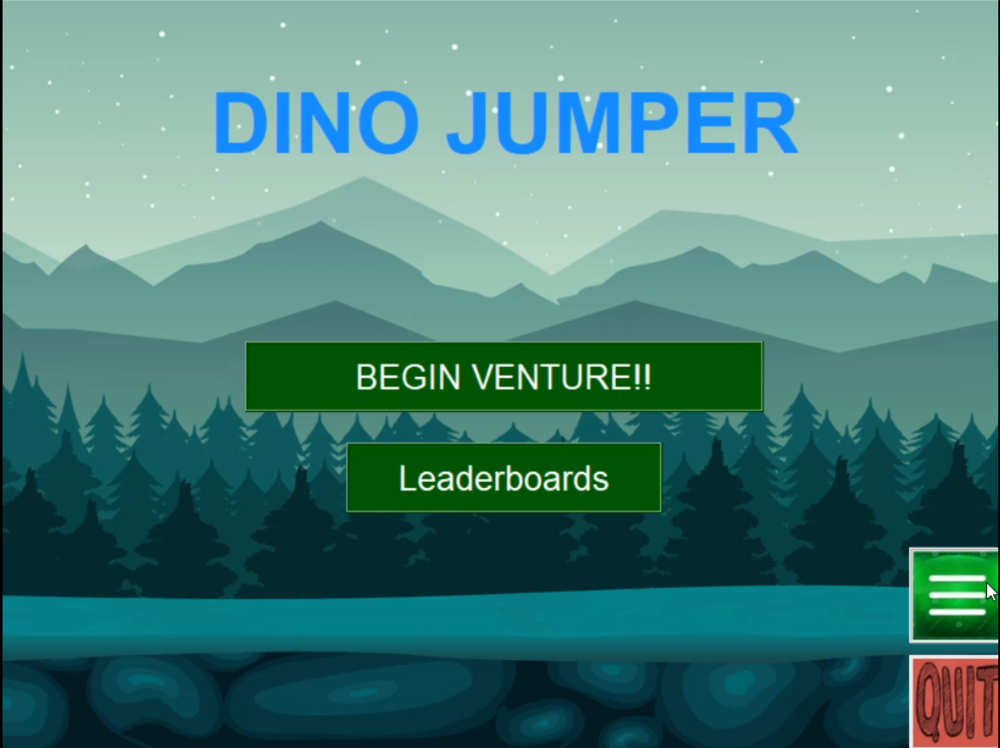
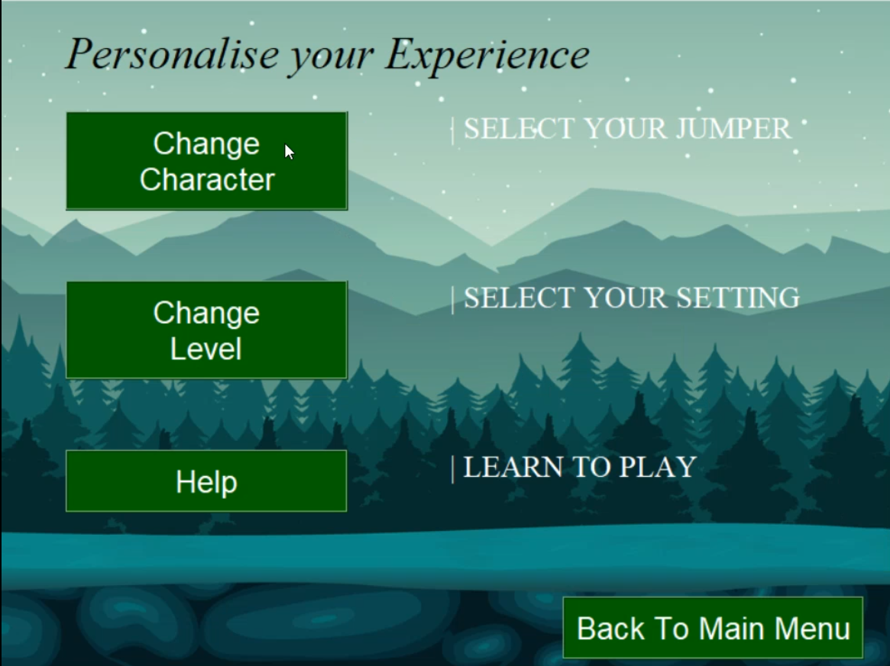
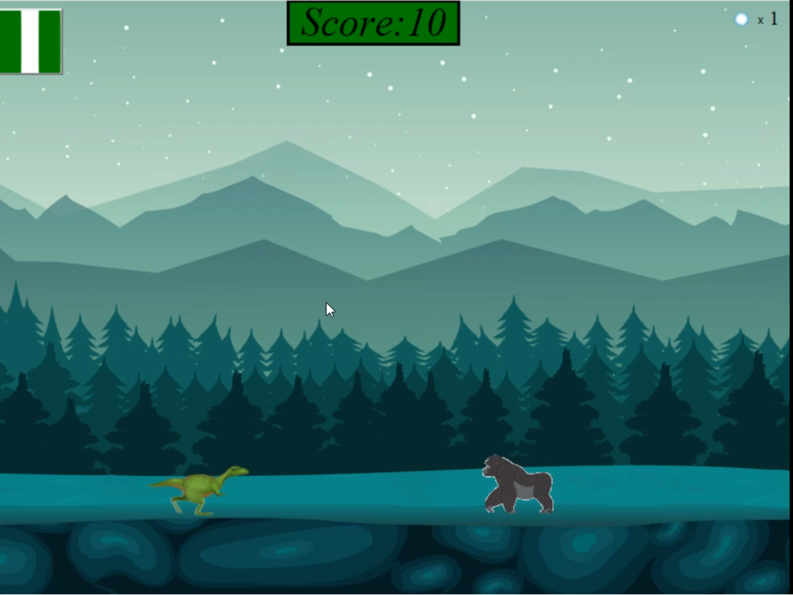
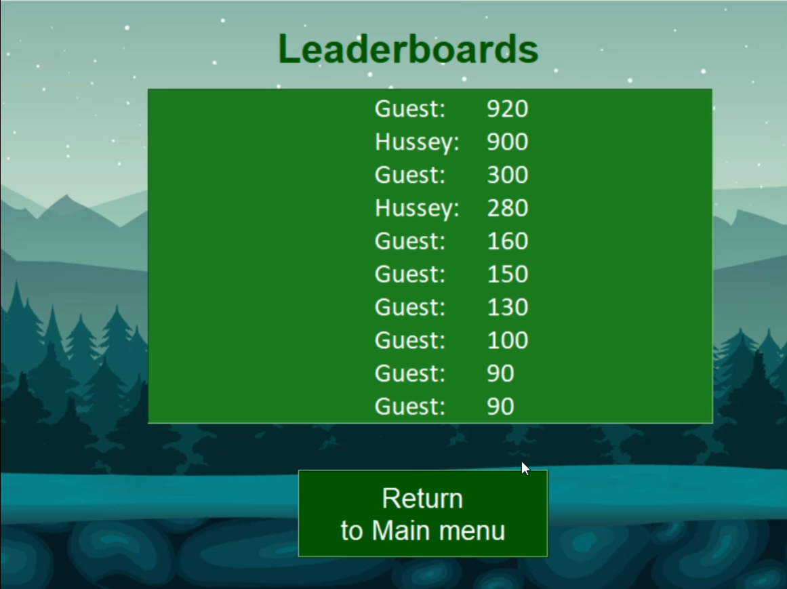

<p align="center">⚠️ This Project is still under progress ⚠️</p>

# T-Rex Tkinter

## Project Description

The goal of this project was to create an engaging and customizable jumping dinosaur game using the Python Tkinter library, overcoming the challenges of game development with this toolkit. The solution involves a dynamic game where players control a dinosaur to jump over hurdles, earning points and tracking high scores. Customizable features such as background and avatars enhance user engagement. This project not only showcases the versatility of Tkinter in game development but also provides a fun, personalized gaming experience, highlighting the potential for creating interactive applications.

## Screenshots

### Main Page


### Settings Page


### Playing Game


### Leaderboard


## 🚀 Objectives

👉 Develop an engaging and interactive jumping dinosaur game using Tkinter. <br/>
👉 Overcome the challenges of game development with the Tkinter library. <br/>
👉 Provide customizable features such as backgrounds and avatars to enhance user engagement. <br/>
👉 Implement a scoring system to track player progress and high scores. <br/>
👉 Showcase the versatility of Tkinter in creating interactive applications. <br/>

## Features and Functionality

🎮 Dynamic gameplay with player-controlled dinosaur jumps. <br/>
🎮 Hurdles and obstacles to increase the challenge. <br/>
🎮 Points system to reward player skill and progress. <br/>
🎮 High score tracking for competitive play. <br/>
🎮 Customizable backgrounds and avatars for personalized gameplay. <br/>

## 💡 Future Plans

- Add more character and background customization options.
- Implement different difficulty levels to cater to various player skills.
- Introduce power-ups and special items to enhance gameplay.
- Develop a mobile-friendly version of the game.
- Expand the leaderboard to include global rankings.

## How to Build and Run

1. **Clone the Repository:**
   ```bash
   git clone https://github.com/your-username/T-Rex-Tkinter.git
   cd T-Rex-Tkinter
   ```
2. **Install dependencies:**
   Ensure you have Python installed.
   Install libraries including tkinter, json, winsound and OS.

3. **Run the game:**
   ```bash
   python Trex.py
   ```

4. **Customize Settings:**
   Access the settings page to change character avatars, backgrounds, or difficulty levels.
   View the help section for detailed instructions on gameplay.

5. **Start Playing:**
   Click play and enjoy!


## Technologies Used
1. **Python:** The core programming language used for development.
2. **Tkinter:** For creating the graphical user interface and game elements.
3. **Winsound:** For adding sound effects to the game.
4. **JSON:** For storing and managing game settings and high scores.
5. **OS:** For handling file operations and interacting with the operating system.

NOTE: PLEASE LET ME KNOW IF YOU DISCOVER ANY BUGS OR HAVE ANY SUGGESTIONS
